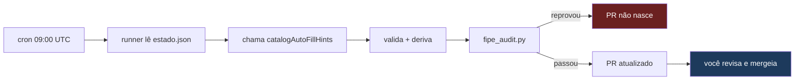

# O agente da base FIPE

Preenche `docs/*.json` — a base de preço e dado técnico de chave que o App do
Chaveiro lê **direto do GitHub, sem cache**, a cada consulta de ~10 mil
usuários. Roda sozinho todo dia; você é quem revisa o que ele produz antes do
merge.

Se você está chegando agora, leia primeiro
[`ONBOARDING_JOAO.md`](https://github.com/agipensador/repo_app_chaveiro/blob/main/docs/ONBOARDING_JOAO.md)
(repo `repo_app_chaveiro`) — ele dá o contexto de negócio que esta skill
assume que você já tem. Esta skill é o "como"; aquele documento é o "onde
estamos e por quê".

## A regra que governa tudo aqui

**A base é pública e o app não tem cache nem versão entre o dado e o
usuário.** Um merge chega aos 10 mil chaveiros em segundos, e não existe
rollback publicando outra versão do app — o dado não vem do binário.
Consequência prática:

- O agente **nunca** commita no `main`. Só abre PR.
- O agente **nunca** sobrescreve valor existente. Só preenche o que falta.
- Toda coleta passa por validação (regras de preço) e por auditoria
  (`fipe_audit.py`, que simula a leitura do app) antes de o PR nascer.
- **Você é o último passo.** Revisar um PR do agente não é formalidade — é o
  único ponto em que um erro em escala ainda é reversível.

Antes de relaxar qualquer uma destas regras, pare e me pergunte.

## Comandos

```bash
cd tools/agente   # a partir da raiz do repo fipe

node agente.mjs --relatorio    # o que falta, por marca — não grava, não custa crédito
node agente.mjs --dry-run      # simula a coleta e a escrita, sem gravar nem chamar a rede de escrita
node agente.mjs --executar     # coleta de verdade, grava local e prepara o PR

node teste-gabarito.mjs --marca renault --amostra 20
# mede taxa de acerto contra dado que já sabemos estar certo (gabarito).
# Sem AUTOFILL_URL configurada, roda em modo SIMULADO: só valida regras e
# derivação, não mede a coleta real.

node consultar.mjs --marca renault --modelo duster --ano 2015
node consultar.mjs --marca jaecoo --modelo elite --remoto
# mostra campo a campo o que o chaveiro vê no app. `--remoto` baixa do GitHub
# (o que o app de fato consome); sem a flag, lê o arquivo local — que pode ter
# coisa ainda não commitada. A DIFERENÇA entre os dois é o que está esperando
# merge.
```

⚠️ **Rode `--relatorio` e `--dry-run` à vontade — não custam crédito de API
além do necessário e não gravam nada.** São o jeito seguro de entender o
pipeline antes de tocar em `--executar`.

## Onde cada peça mora

| Peça | Arquivo | Faz o quê |
|---|---|---|
| Orquestração | `agente.mjs` | percorre marca → modelo → ano, chama a function, aplica validação, grava |
| Regras de validação | `validacao.mjs` + `config.json` | ordem de preço, razão, faixa, derivação entre anos |
| Auditoria (o portão) | `../fipe_audit.py` | simula `FipeJsonLookup` do app; se reprovar, o PR não nasce |
| Consulta/diagnóstico | `consultar.mjs` | mostra um veículo como o app o vê, local ou remoto |
| Teste contra gabarito | `teste-gabarito.mjs` | mede acerto real, nunca confie em número sem isto |
| Checkpoint | `estado.json` | onde o agente parou; **precisa estar no commit do PR**, senão reprocessa tudo de novo amanhã |
| Fila de revisão | `revisao-pendente.json` | campos de fonte única — não entraram sozinhos, esperam seu olho |
| Workflow diário | `../../.github/workflows/agente-diario.yml` | roda 09:00 UTC (06:00 BRT), abre/atualiza o PR |
| A function que ele chama | `catalog_autofill_hints.ts` + `catalog_autofill_search.ts` (repo `repo_backend_app_chaveiro`) | busca via Gemini + `google_search`, extrai campos |

## As regras de sanidade — por que existem, medidas, não inventadas

Sobre os registros bons da base (marcas com 100% de cobertura):

- **Ordem obrigatória:** `valueKeyCopy ≤ valueKeyAlarm ≤ valueKeyConfectAlarm`
  — 100% dos registros completos respeitam.
- **Razão `confec/copy` entre 0,5 e 8,0** (mediana 2,27, 98% dos casos) — é o
  que pega o erro clássico de capturar o preço do **carro** em vez do preço
  da **chave**. Faixa absoluta larga de propósito (R$20 a R$130.000): a base
  vai de Fusca a Rolls-Royce, faixa estreita reprovaria dado legítimo.
- **Nunca grava `"0"`.** Campo ausente é melhor que campo errado — o app
  trata ausência (não exibe a linha); valor errado ele exibe como verdade.
- **Consulta é por ANO, nunca agrupada por modelo.** Um mesmo modelo pode
  trocar de lâmina entre gerações (Fiat Palio: `GT15` até 2002, `GT15ouSIP22`
  de 2003 em diante) — agrupar gravaria a peça errada em vários anos de uma
  vez.
- **Derivação de preço entre anos vizinhos é permitida** (erro mediano 3,9%
  a 1 ano, 6,4% a 2 anos) e é o que torna o volume viável — sem ela seriam
  ~117 mil consultas, com ela ~2 mil. **Dado técnico nunca é derivado**: lâmina
  e transponder mudam em degrau (ou é a mesma peça, ou é outra), não em
  rampa — estimar não tem significado.
- **Vídeo reaproveitado não é erro; vídeo sem relação é.** Veículos da mesma
  plataforma usam o mesmo procedimento de cópia/clonagem legitimamente. O
  defeito medido na base (206 vídeos distintos colados em quase 12 mil
  registros) veio de aceitar vídeo cujo título citava **marca errada** —
  rejeite sempre que o título mencionar marca diferente do registro.

Todos os limiares vivem em `config.json`, com o comentário `_nota` explicando
a medição por trás de cada um. **Não ajuste um número sem reler o comentário
ao lado dele** — cada valor já foi calibrado uma vez e corrigido depois de dar
errado (ex.: faixa por mediana reprovava 28,6% de dado bom antes de virar
faixa absoluta larga).

## As três camadas de confiança

| Confiança | Critério hoje | Destino |
|---|---|---|
| 🟢 Alta | passa a validação, `min_fontes_para_auto` fontes concordam | entra no arquivo, vai no PR |
| 🟡 Média | passa a validação, mas fonte única ou fontes divergem | `revisao-pendente.json` — você decide |
| 🔴 Baixa | viola a validação, ou nenhum `groundingChunks` (busca não aconteceu de verdade) | descartado, motivo registrado |

⚠️ `min_fontes_para_auto` está em **1** desde 22/09/2026, deliberadamente
baixo — ver o comentário `_limiar_nota` em `config.json`. Quem segura o erro
não é esse número, são as regras de validação acima. Não suba esse limiar sem
entender por que ele foi baixado (marca nova/pouca cobertura web quase nunca
teria 2 fontes, e é justamente ela que mais precisa do agente).

## De onde vêm os dados hoje, e como adicionar uma fonte nova

**Não existe uma lista de sites configurável.** Isso já foi tentado (Google
Custom Search Engine, restrito a um punhado de domínios como
`chiptronic.com.br`, `lionsdistribuidora.com.br`) e foi abandonado em
15/09/2026 porque o Google revogou o acesso deste projeto à Custom Search
JSON API (403, sem configuração que resolva — é uma restrição de plataforma).

A busca hoje é **Gemini com `google_search` grounding** — busca livre na web,
sem allowlist de domínio. O modelo decide o que consultar; o código só valida
o que volta. Isso está implementado em `catalog_autofill_search.ts`, no repo
`repo_backend_app_chaveiro`.

### O que significa "adicionar um novo site ou fonte", na prática atual

Como não há lista de domínios, influenciar de onde o dado vem passa por
ajustar o **prompt de busca** que a function manda ao Gemini — por exemplo,
mencionar explicitamente um site conhecido por ser bom no assunto (uma loja
de peças com catálogo público, um fórum de chaveiros) para aumentar a chance
de ele aparecer nos resultados. Isso é o item de trabalho descrito no
onboarding: **é algo a construir, não algo que já existe como configuração.**

Antes de implementar, considere:

- **Testar primeiro se o Gemini já encontra a fonte sozinha.** Rode
  `teste-gabarito.mjs` numa marca com gabarito conhecido e veja se o resultado
  já cita a fonte desejada em `groundingChunks` antes de forçar no prompt.
- **Marketplaces (Mercado Livre, Shopee, AliExpress) têm API oficial.**
  Preferível a tentar induzir o Gemini a buscar lá, e mais estável que
  raspagem — essas plataformas têm proteção anti-bot e mudam layout, e o modo
  de falha de um scraper quebrado é o pior possível: ele não para, passa a
  extrair o campo errado.
- **Apps de terceiro (Help Key, Ferramenta Chaveiro, Gamarra)** — antes de
  automatizar a UI (frágil, caro de manter), verifique se eles expõem uma API
  HTTP por trás. A maioria tem.
- Qualquer fonte nova entra pelo mesmo funil de validação — não crie um
  caminho que pule a checagem de ordem/razão/faixa só porque a fonte parece
  confiável.

## O ciclo diário, e como acompanhar



- **GitHub → Actions → "Agente FIPE (diário)"** — cada execução deixa um
  resumo na própria página (o que faltava, o que coletou).
- **O PR é um só, atualizado todo dia** — não 365 PRs por ano.
- **`estado.json` precisa estar no commit do PR.** O runner do GitHub é
  descartado ao terminar; sem o checkpoint versionado, cada execução
  recomeçaria do zero e nunca avançaria enquanto o PR esperasse revisão.

### O sintoma de que algo parou (falhas silenciosas conhecidas)

| Sintoma | Causa provável | Onde checar |
|---|---|---|
| Dias sem PR novo | crédito da Gemini acabou (`429`) ou senha do agente mudou | log da Action mais recente |
| PR nasce vazio ou pequeno | cota diária de veículos é baixa por desenho (evita gastar crédito) | `veiculos_por_execucao` em `config.json` |
| Auditoria reprova sempre | formato herdado (nós antigos que não são o agente que gerou) — ver seção abaixo | `fipe_audit.py` output |

### 🔴 O bloqueio conhecido em 25/09/2026

A primeira execução real no GitHub Actions teve a auditoria reprovando. A
causa: **1.727 registros em 16 marcas** (`volkswagen`, `toyota`, `nissan`,
`fiat2`, `ford`, `mitsubishi`, entre outras) estão num formato antigo, onde o
nível que deveria ser combustível (`Gasolina`/`Diesel`) guarda em vez disso o
nome de um campo técnico (`laminasKeys`). O runner já pula esses nós ao
coletar — o auditor os vê e reprova mesmo assim. **A auditoria compara contra
o estado anterior e só barra se o agente piorou**, então isso pode já estar
resolvido; confira o log da execução mais recente antes de investigar do
zero. Se ainda travar, a correção é converter esses 1.727 nós para o formato
atual — transformação de dado (o modelo e o ano já existem, falta inferir o
combustível), não coleta nova. Faça com `--dry-run` e merge, nunca
sobrescrita, do mesmo jeito que o exportador do site já fez isso para outras
8 marcas.

## Credenciais e acesso — o que você administra

| O quê | Onde | Para quê |
|---|---|---|
| Secrets do GitHub Actions (`AUTOFILL_URL`, `AGENTE_EMAIL`, `AGENTE_SENHA`, `FIREBASE_WEB_API_KEY`) | repo `fipe` → Settings → Secrets and variables → Actions | o runner troca e-mail+senha por um ID token a cada execução (token do Firebase expira em 1h — token fixo falharia em silêncio no dia seguinte) |
| Claim `catalogAgent` | Firebase Auth, usuário `agente-catalogo@inforizz.com` | dá ao agente uma identidade própria, sem depender da conta pessoal do dono do projeto |
| Deploy da function `catalogAutoFillHints` | `repo_backend_app_chaveiro/functions` | **você pode fazer** — é a function do agente, não a de pagamento |
| Secret do Gemini (`GEMINI_API_KEY`) | Secret Manager do Firebase | recarga de crédito é o que evita a falha silenciosa de `429` |

⚠️ **Fora do seu escopo, deliberadamente:** deploy do app Flutter e deploy do
codebase `default` de pagamentos (Asaas/Pix/webhook) no backend. Essas partes
movem dinheiro de assinantes reais e continuam com o dono do projeto. Se uma
mudança sua no agente tocar em algo dessas áreas, pare e confirme antes.

O passo a passo completo de criar o usuário de serviço, conceder a claim e
publicar a function está em `tools/agente/CLAIM.md`, neste repositório.

```bash
# revogar o agente (botão de desligar, se algo der muito errado)
cd repo_backend_app_chaveiro/functions
node scripts/conceder-claim-agente.mjs --email agente-catalogo@inforizz.com --revogar
```

## Testar sem gastar cota

- `--relatorio` e `--dry-run`: não custam nada de rede além do necessário.
- `teste-gabarito.mjs` sem `AUTOFILL_URL` configurada: roda em modo simulado,
  só exercita validação e derivação — não mede taxa de acerto real, mas não
  custa crédito.
- Para medir taxa de acerto de verdade, rode `teste-gabarito.mjs --marca
  renault --amostra 20` **com** `AUTOFILL_URL` configurada e compare contra o
  gabarito (a `renault` tem 446 anos, 100% com preço — é a marca certa para
  isso, porque você sabe a resposta certa de antemão). **Nunca escale para
  uma marca nova sem antes medir contra uma marca-gabarito.**

## Ao desenvolver no agente

1. Rode `--relatorio` antes e depois da sua mudança — se o número de lacunas
   detectadas mudou sem você ter mexido na lógica de detecção, investigue.
2. Qualquer mudança em `validacao.mjs` ou `config.json` exige rodar
   `teste-gabarito.mjs` de novo antes de merge — mudar um limiar sem medir o
   efeito é como o limite de fonte único virou 1 (medido, não chutado).
3. Mudança na estrutura do JSON de saída exige rodar `fipe_audit.py` contra a
   base inteira, não só contra a marca que você tocou — ele é o portão real do
   workflow.
4. **Preserve ordem e indentação do JSON existente ao gravar.** Já aconteceu
   de uma gravação reformatar um arquivo inteiro (8452 linhas removidas por
   engano de indentação) e de uma reordenação alfabética "para limpar"
   produzir um diff pior, não melhor. Chaves novas entram no fim; o Git então
   mostra como acréscimo puro, que é revisável. Diff irrevisável numa base
   pública é o próprio risco que todo o desenho tenta evitar.
