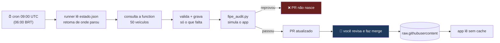

# Agente de preenchimento da base FIPE

Descobre o que falta, coleta, valida e abre Pull Request — diariamente, sem
ninguém acompanhar.

## Comandos

```bash
node tools/agente/agente.mjs --relatorio    # o que falta, por marca
node tools/agente/agente.mjs --dry-run      # simula, não grava
node tools/agente/agente.mjs --executar     # grava e prepara o PR

node tools/agente/teste-gabarito.mjs --marca renault --amostra 25
```

## ✅ Estado em 15/09/2026 — o agente está autenticado e chamando a function

A claim foi concedida e a function publicada. Medido:

```
login do agente          → ✅ catalogAgent: true no token
catalogAutoFillHints     → ✅ HTTP 200 (antes: 403)
configured               → {googleCse: true, youtube: true, gemini: true}
```

### 🔴 Mas a coleta de PREÇO volta vazia

Teste de gabarito com coleta real, 6 veículos da Renault:

    campos aprovados automaticamente: 0
    enviados para revisão humana:     4   (todos videoLink)
    consultas que falharam:           0

O diagnóstico está no `meta` da resposta:

    search: {"textItems": 0, "priceQueries": 5, "imageQueries": 6}
    aviso: "O Google CSE não devolveu resultados textuais. Confira no
            Programmable Search Engine se a opção de buscar em toda a web
            está ligada."

**5 consultas feitas, 0 resultados de texto.** O motor de busca está
restrito a sites específicos em vez de pesquisar em toda a web. Não é defeito
do agente nem da function — é configuração do CSE.

Confirmado no painel (15/09/2026): **"Pesquisar em toda a Web" está
DESLIGADO**, e há uma lista curta de "Sites para pesquisar"
(`chiptronic.com.br`, `lionsdistribuidora.com.br`, …). O motor só busca
nesses domínios — daí `textItems: 0` para consulta de preço.

- [ ] https://programmablesearchengine.google.com → motor `5594a87d7a6854571`
      → Recursos de pesquisa → **Pesquisar em toda a Web: ATIVAR**
- [ ] Repetir: `node tools/agente/teste-gabarito.mjs --marca renault --amostra 10`

### 🔴 A CAUSA REAL: o Google revogou o acesso à Custom Search JSON API

⚠️ **Correção a um diagnóstico anterior.** Eu havia apontado o toggle
"Pesquisar em toda a Web" como causa do `textItems: 0`. **Não era.** O toggle
está desligado e **não pode ser ativado** — o motor já foi migrado para o novo
regime.

Testando a API diretamente com a chave do Secret Manager
(`catalog-autofill-cse`, corretamente restrita ao Custom Search):

    GET customsearch/v1?key=…&cx=5594a87d7a6854571&q=duster+2015
    → HTTP 403
      "This project does not have the access to Custom Search JSON API."

E `customsearch.googleapis.com` está **ENABLED** no projeto. Ou seja: a API
está habilitada, a chave é a certa e tem a restrição correta — e o Google
nega assim mesmo.

É uma **restrição que o Google passou a aplicar em 2026**, relatada por vários
desenvolvedores, atingindo inclusive projetos antigos. Não há configuração
que resolva.

**Consequência: o caminho do CSE está encerrado.** Não é "vai acabar em
01/01/2027" — já acabou para este projeto.

### O plano B: Gemini com grounding

A Gemini responde (`HTTP 200`) e os modelos atuais (`gemini-3.6-flash`) têm
**grounding with Google Search** — busca web nativa, que substitui o papel do
CSE sem depender dele.

⚠️ **Mas os créditos acabaram:**

    → HTTP 429
      "Your prepayment credits are depleted. Please go to AI Studio…"

- [ ] Recarregar créditos em https://ai.studio/projects (ou ativar billing)
- [ ] Reescrever a camada de busca de `catalog_autofill_hints.ts` para usar
      `gemini-3.6-flash` com `tools: [{google_search: {}}]` no lugar do CSE
- [ ] ⚠️ `gemini-2.5-flash` **não está mais disponível** para novos usuários —
      a própria API responde indicando `gemini-3.6-flash`. O código atual
      precisa ser conferido quanto ao modelo que referencia.

⚠️ **O YouTube também está desligado**: `youtube.googleapis.com → DISABLED`.
Curiosamente o `videoLink` funcionou — provavelmente via CSE de imagens ou
fallback. Vale confirmar depois que a busca voltar.

### Histórico: o prazo do CSE (agora irrelevante para nós)

Levantado na documentação do Google em 15/09/2026:

1. **Ligar o toggle é seguro; DESLIGAR não tem volta.** A documentação diz:
   *"Once you toggle this setting to Off, you cannot turn it back On."*
   Como hoje está desligado, ativar é a direção certa — mas não desative
   depois "para testar".

2. **O recurso está sendo encerrado.** Motores criados a partir de
   20/01/2026 **não têm** a opção (limite de 50 domínios). Motores
   existentes, como o `5594a87d7a6854571`, funcionam **até 01/01/2027**.
   Vale para a Custom Search JSON API — que é exatamente o que
   `catalog_autofill_hints.ts` usa.

**Consequência para o agente:** a coleta via CSE tem ~15 meses de vida. Isso
não invalida o que foi construído — validação, derivação, claim, workflow e
formato-alvo são independentes da fonte de busca. O que precisa de plano B é
a **camada de busca**.

- [ ] Antes de 01/01/2027, trocar o CSE por outra fonte. Candidatos: a
      própria Gemini (já configurada e já usada como camada B), Vertex AI
      Search, ou as APIs oficiais dos marketplaces
- [ ] ⚠️ Os 50 domínios do modo restrito podem bastar: se as fontes boas de
      preço de chave forem poucas e conhecidas (Chiptronic, Lions, Gamarra,
      SuperKey…), o modo restrito não é perda — é foco. **Medir antes de
      concluir**

⚠️ **O `videoLink` funciona** (YouTube API, confiança 82) — ou seja, o
caminho ponta a ponta está íntegro; falta só a busca textual devolver algo.

## ⚠️ Histórico: o que bloqueava antes

As duas Cloud Functions **estão publicadas** (verificado em 15/09/2026):

    catalogAutoFillHints  → HTTP 403 (exige autenticação)
    fipeProxy             → HTTP 405 (responde, método errado no teste)

O 403 não é erro de configuração. `catalog_autofill_hints.ts:119` exige um
**ID token do Firebase Auth do usuário `gbrrizzardo@gmail.com`**:

```ts
function assertCatalogAdmin(email) {
  if (email !== "gbrrizzardo@gmail.com") throw new HttpsError("permission-denied", …);
}
```

Não basta credencial de administrador do projeto — é token de usuário final.
A credencial disponível na máquina é `contato@inforizz.com`, de outra conta
(ver a nota sobre as duas contas Google na memória do projeto).

### As duas saídas

**A. Conta de serviço com custom claim** — recomendada para automação.
Criar um usuário de serviço, dar a ele uma claim (`catalogAgent: true`) e
trocar a verificação de e-mail por verificação de claim. O e-mail fixo no
código é frágil: amarra a automação a uma pessoa.

**B. Token de longa duração** — mais rápido, pior a longo prazo. Gerar um
refresh token de `gbrrizzardo@gmail.com` e guardá-lo no secret
`AUTOFILL_TOKEN` do GitHub. Funciona, mas o token expira e a automação
silencia até alguém perceber.

## O que já foi medido

### Validação (0,40% de reprovação)

Rodada contra os 5026 registros com preço de `docs/`:

| Reprovados | Motivo |
|---:|---|
| 13 | ordem invertida (`alarme < cópia`) |
| 3 | razão confec/copy fora de 0,5–8,0 |
| 1 | `"www"` gravado como preço (`agrale.json`) |
| 3 | fora da faixa absoluta |

**São defeitos reais da base, não falsos positivos.** A primeira calibração
usava faixa por mediana e reprovava **28,6%** de dado legítimo — a base vai de
R$20 (Audi A6 1995) a R$125.000 (Rolls-Royce Cullinan), e faixa absoluta não
discrimina. O que discrimina é a **razão entre campos**.

### Derivação entre anos (medida na `renault`)

| Distância | Erro mediano | ≤10% | ≤15% |
|---|---|---|---|
| 1 ano | **4,0%** | 94% | **100%** |
| 2 anos | **5,0%** | 74% | 89% |
| 3 anos | 8,3% | — | 74% ← **cortado** |

É o que torna o agente viável: sem derivar, são 117 mil consultas (~8 anos a
50/dia). Derivando, caem para ~2 mil.

⚠️ Valor derivado recebe `_derivadoDe` no registro. É estimativa, não medição,
e quem revisa o PR precisa conseguir distinguir.

### A taxa de acerto da coleta — medida, e o resultado é zero

Rodada em 15/09/2026 com coleta real (6 veículos da Renault):
**0 campos de preço coletados.** Não por erro do agente — a busca devolveu
`textItems: 0`. Ver a seção do CSE no topo.

⚠️ Enquanto o CSE não pesquisar em toda a web, **não há como afirmar que o
agente acerta**. O que está provado: autenticação, chamada à function,
validação, derivação e o caminho do `videoLink`. Falta a busca textual.

## Cota: 50/dia não cabe no plano gratuito

Configurado para 50 veículos/execução. Mas cada veículo custa **mais de uma**
consulta ao CSE (preço, lâmina/transponder e vídeo são buscas separadas), e o
plano gratuito dá **100 consultas/dia**.

Na prática: ou o plano pago do CSE ($5/1000 consultas), ou o agente para no
meio do lote. Ele trata isso sem quebrar — registra e retoma amanhã do mesmo
ponto, pelo `estado.json`.

## Segurança

- **Nunca commita no `main`.** Abre PR. O app lê estes JSONs do GitHub **sem
  cache**: o merge chega aos 10 mil usuários em segundos, e não há rollback
  por versão do app.
- **Nunca sobrescreve.** Só preenche o que falta.
- **`fipe_audit.py` é o portão.** Simula a lógica de `FipeJsonLookup` do app;
  se o agente gerar algo que o app não leria, o PR não nasce.
- **Link de vídeo tem allowlist** (YouTube/TikTok/Instagram/Kwai, só https).
  Sem ela, o campo vira vetor de link malicioso.

---

## ✅ 22/09/2026 — primeira execução real (jaecoo)

```
▶ jaecoo: 3 modelos com lacuna
  ✅ 7 Elite 2027: +7      ✅ 7 Elite 32000: +6
  ⚪ 7 Prestige 2026: nada  ✅ 7 Prestige 32000: +8
  ✅ 7 Luxury 2026: +6     ✅ 7 Luxury 32000: +6

campos gravados: 5 registros | revisão: 6 | descartados: 0
git diff: 39 inserções, 0 remoções | integridade: nada perdido, nada alterado
```

Amostra do que entrou — dado de chaveiro de verdade:

    transponderNomenclatura: "ID47"
    telecomandoFrequency:    "433 MHz"
    laminaTextDica:          "Acompanha lâmina de emergência pantográfica…"
    telecomandoProcedure:    "…via OBD. Exige senha da autorizada."

### Defeito corrigido no runner

Ele consultava **só `alvo.anos[0]`** e passava ao modelo seguinte — um ano por
modelo. Contradizia a regra medida (Palio troca de lâmina entre 2002 e 2003).
Agora percorre **todos os anos**, e o orçamento é decrementado por ano.

## Como isto se mantém rodando

### O ciclo diário



### ⏱️ Os chaveiros veem em tempo real?

**Depois do merge, sim — em segundos.** O app baixa o JSON direto do GitHub
**a cada consulta, sem cache** (`app_card_controller.dart:108`). Não precisa
de nova versão na Play: o merge chega a todos os 10 mil imediatamente.

⚠️ **É por isso que o PR existe.** Sem revisão, um erro também chega em
segundos — e não há rollback por versão do app, porque o dado não vem do
binário. O gargalo é deliberado.

### O que mantém vivo sem ninguém olhar

| Mecanismo | Onde | O que resolve |
|---|---|---|
| `estado.json` | checkpoint por marca | retoma de onde parou; cota diária não perde trabalho |
| Login a cada execução | `idToken()` | token do Firebase expira em 1h — trocar e-mail+senha por token novo nunca vence |
| `fipe_audit.py` | passo do workflow | se o agente gerar algo que o app não leria, o PR não nasce |
| PR único atualizado | `create-pull-request` | um PR vivo em vez de 365/ano que ninguém revisa |
| Merge, nunca sobrescrita | `valorUtil()` | o que você já conferiu fica intocado |

### O que PODE parar em silêncio — e como notar

- [ ] **Crédito da Gemini acabar.** O erro é `429/402 prepayment credits`. O
      agente registra e segue; nenhum campo entra. ⚠️ Ativar **recarga
      automática** no AI Studio é o que evita isso
- [ ] **Senha do agente trocada** → login falha, nenhuma consulta acontece
- [ ] ⚠️ **O PR parado é o sintoma visível de qualquer um dos dois.** Se
      passar dias sem PR novo, algo parou

- [ ] Configurar os 4 secrets no GitHub (`AUTOFILL_URL`, `AGENTE_EMAIL`,
      `AGENTE_SENHA`, `FIREBASE_WEB_API_KEY`) — ver `CLAIM.md`
- [ ] Rodar o workflow manualmente uma vez com `dry_run: true`

### ⚠️ O limiar de 2 fontes barra dado bom em marca de pouca cobertura

Observado na primeira execução (jaecoo). O **7 Prestige 2026** apareceu no log
como `⚪ nada aprovado`, o que soa como falha — mas não foi:

| | 2026 | 32000 (0 km) |
|---|---|---|
| Campos técnicos coletados | **9** | 13 |
| Descartados pela validação | **0** | 0 |
| Entraram no arquivo | ❌ foram para revisão | ✅ |

Os 9 estavam corretos: `ID 47`, `433 MHz`, `iGOLD`, programação via OBD. Só
não tinham **2 fontes** cada — o limiar de `min_fontes_para_auto`.

**A inconsistência que isso cria:** o mesmo veículo recebeu
`transponderNomenclatura` direto no ano `32000` e teve o campo barrado em
`2026`. Só muda o ano-modelo; a diferença foi quantas fontes a busca citou em
cada consulta.

Distribuição dos 24 campos que ficaram em revisão:

    12x  imagens (por desenho — confiança 70, sempre vão para revisão)
    12x  dado técnico legítimo barrado por fonte única

⚠️ **Decisão pendente, e é de produto:**

- [ ] **Manter em 2** — mais seguro, mas marca nova e de pouca cobertura web
      (chinesas, importadas) quase nunca entra sozinha
- [ ] **Baixar para 1 em campos técnicos**, mantendo 2 para PREÇO — o técnico
      é verificável por quem lê (`ID 47` ou está certo ou não está), enquanto
      preço errado passa despercebido
- [ ] **Ou deixar como está e revisar a fila** — `revisao-pendente.json` é
      exatamente para isso

Sem decisão, o comportamento atual é o conservador: nada errado entra, e o
dado bom espera na fila.

---

## Como acompanhar o agente

### 1. A aba Actions — o painel diário

Cada execução escreve um **resumo** na própria página, sem precisar abrir log:

- o `estado.json` (onde parou, quantos campos já preencheu, quantas execuções)
- o relatório do que ainda falta, por marca
- as mudanças daquele dia

```
Repositório fipe → Actions → "Agente FIPE (diário)" → última execução
```

### 2. Consultar um veículo como o app o vê

```bash
node tools/agente/consultar.mjs --marca renault --modelo duster
node tools/agente/consultar.mjs --marca jaecoo --modelo elite --ano 2027
node tools/agente/consultar.mjs --marca jaecoo --modelo elite --remoto
```

Mostra campo a campo o que o chaveiro veria, com ✅/⬜ e o percentual
preenchido.

⚠️ **`--remoto` é o teste que importa.** Sem a flag lê o arquivo local; com
ela baixa do GitHub — que é o que o app realmente consome. A diferença entre
os dois é **o que ainda não foi commitado**.

Exemplo real (23/09/2026, Jaecoo 7 Elite 2027):

    local:   12/21 campos (57%)   ← o agente já coletou
    remoto:   5/21 campos (24%)   ← o chaveiro ainda vê isto

Os 7 campos de diferença estão esperando merge.

### 3. O ciclo, e onde cada etapa aparece

| Etapa | Onde você vê | Quando |
|---|---|---|
| Agente rodou | Actions → resumo | todo dia 06:00 BRT |
| O que coletou | PR "Agente: preenchimento automático" | mesmo dia |
| O que entrou na base | `git diff` do PR | ao revisar |
| **O que o chaveiro vê** | `consultar.mjs --remoto` | **após o merge** |

### ⚠️ Quem garante que está funcionando

Três mecanismos, e nenhum depende de alguém lembrar:

1. **`fipe_audit.py`** roda antes do PR e simula a lógica do app. Se o agente
   gerar algo que o aplicativo não conseguiria ler, **o PR não nasce**.
2. **A validação** (razão entre preços, ordem, verificação de vídeo e imagem)
   reprova antes de gravar.
3. **O PR parado é o sintoma.** Se passar dias sem PR novo, algo travou —
   crédito da Gemini acabou, ou a senha do agente mudou. São as duas falhas
   silenciosas possíveis.

### Médio e longo prazo

O `estado.json` acumula `totalPreenchido` e `execucoes` — é a série
histórica do progresso. Com o relatório diário, dá para responder "quanto
andamos no mês" sem instrumentação extra.

⚠️ **O checkpoint precisa estar no PR.** O workflow parte da branch do agente
(não do `main`) justamente por isso: enquanto o PR espera revisão, o
progresso se acumula nele. Partindo do `main`, o agente reprocessaria os
mesmos veículos todo dia até o merge.
